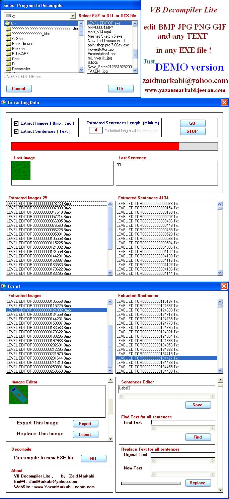



## VB Decompiler Lite 2009

### Description

VB Decompiler Lite

VB Decompiler is decompiler for programs (EXE, DLL or OCX) written in Visual Basic 5.0 and 6.0. As you know,

programs in Visual Basic can be compiled into interpreted p-code or into native code.

If a program was compiled into the native code, restoring full source code from machine instructions is not possible.

anyway you can edit any text or image which contained in EXE file .

----

Just select EXE file, then edit any text and pictures, then compile edited data to new EXE file .

----

Notice : this is DEMO version ( support Bmp and Jpeg only )

you can get FULL version ( support Gif and Png also ) from my website. don't worry, it's available now..

http://www.yazanmarkabi.jeeran.com/

Notice : I usually post FULL versions in my site after one week, but this FULL code already available in my site.

If you have any suggesting, tell me ,

Em@l : ZaidMarkabi@yahoo.com

Thanks,..

Zaid Markabi
 
### More Info
 

             |
---                |---
**Submitted On**   |2009-01-10 13:02:20
**By**             |[Zaid Markabi](https://github.com/Planet-Source-Code/PSCIndex/blob/master/ByAuthor/zaid-markabi.md)
**Level**          |Advanced
**User Rating**    |3.7 (11 globes from 3 users)
**Compatibility**  |VB 5\.0, VB 6\.0
**Category**       |[Complete Applications](https://github.com/Planet-Source-Code/PSCIndex/blob/master/ByCategory/complete-applications__1-27.md)
**World**          |[Visual Basic](https://github.com/Planet-Source-Code/PSCIndex/blob/master/ByWorld/visual-basic.md)
**Archive File**   |[VB\_Decompi2142181302009\.zip](https://github.com/Planet-Source-Code/zaid-markabi-vb-decompiler-lite-2009__1-71698/archive/master.zip)

